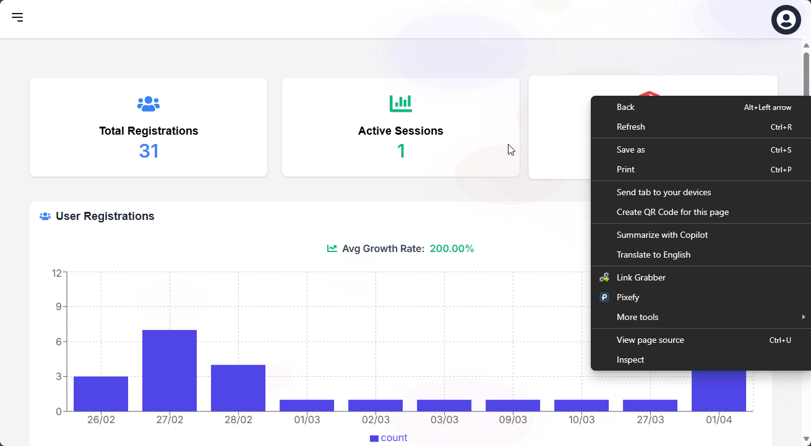
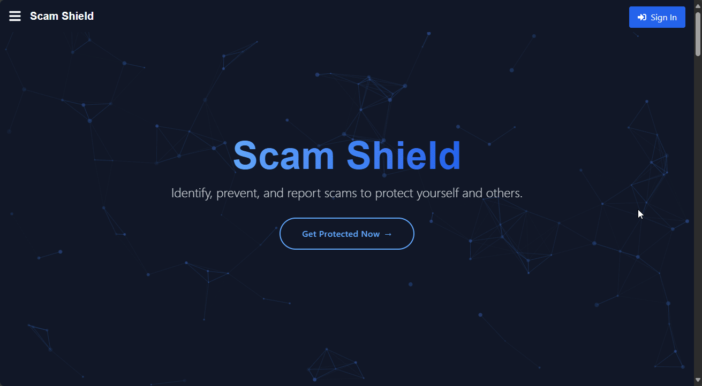
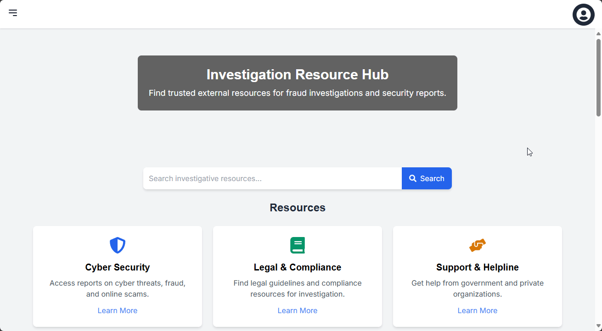
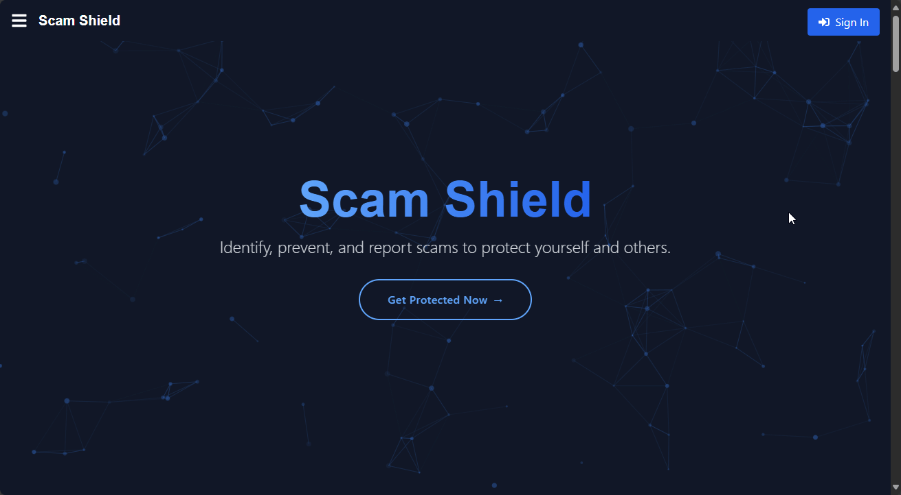

# Scam Awareness Portal

A comprehensive platform for reporting and managing scam incidents with three user models: Admin, User, and External Resource personnel.

## Features

- **User Management**: Registration, login, profile management
- **Scam Reporting**: Submit and track scam reports
- **Admin Dashboard**: Manage users, review reports, analytics
- **External Resource Portal**: Investigation and report management
- **Real-time Analytics**: Track scam trends and statistics

## Demo






## Prerequisites

- Node.js (v14+)
- PostgreSQL (v13+)
- npm or yarn

## Installation

1. Clone the repository:
```bash
git clone https://github.com/crazyscriptright/scam_awareness.git
cd scam_awareness
```

2. Set up the database:
- Create a PostgreSQL database
- Run the SQL commands from database.txt:
```sql
psql -U postgres -h localhost -p 5434 -d Scam_Awareness -f database.txt
```

3. Configure environment variables:
Create .env file in my-server directory:
```env
DB_USER=postgres
DB_HOST=localhost
DB_NAME=Scam_Awareness
DB_PASSWORD=your_password
DB_PORT=5434
SESSION_SECRET=your_session_secret
RECAPTCHA_SECRET_KEY=your_recaptcha_secret
RECAPTCHA_SITE_KEY=your_recaptcha_site_key
```

4. Install backend dependencies:
```bash
cd my-server
npm install
```

5. Install frontend dependencies:
```bash
cd ../front-scam
npm install
```

## Running the Application

1. Start the backend server:
```bash
cd my-server
node indexduplicate.js
```

2. Start the frontend development server:
```bash
cd front-scam
npm run dev
```

The application will be available at:
- Frontend: http://localhost:3000
- Backend: http://localhost:5000

## User Roles

1. **Admin**
   - User management
   - Report review and approval
   - Analytics dashboard
   - System configuration

2. **User**
   - Submit scam reports
   - Track report status
   - Update profile
   - View scam awareness resources

3. **External Resource**
   - Review assigned reports
   - Update investigation status
   - Access specialized tools
   - Collaborate with admin

## Repository

Main repository: https://github.com/crazyscriptright/scam_awareness.git

## Contact

Email: crazyscriptright@gmail.com
Project Link: https://github.com/crazyscriptright/scam_awareness
